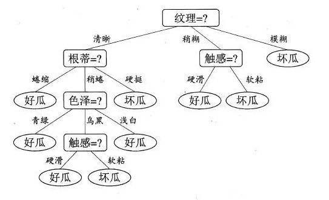
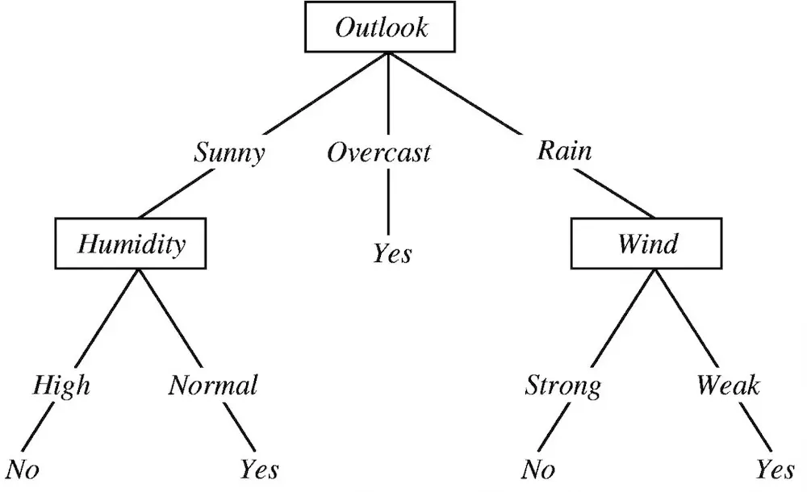
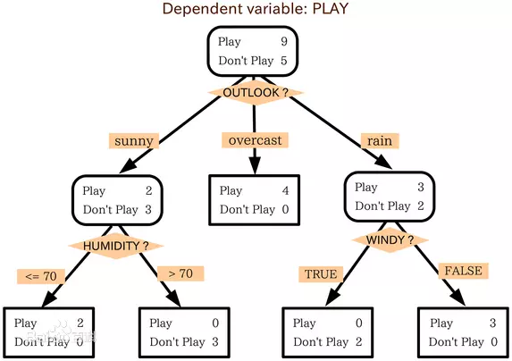

# 决策树

是一种监管学习，十分常用的分类方法。

决定是否打网球数据集

| outlook | temperature | humidity | windy | play |
| --- | --- | --- | --- | --- |				
| sunny | hot |	high | FALSE | no |
| sunny	| hot | high | TRUE | no | 
| overcast | hot | high | FALSE | yes | 
| rainy | mild | high | FALSE | yes | 
| rainy | cool | normal | FALSE | yes |
| rainy | cool | normal | TRUE | no |
| overcast | cool | normal | TRUE | yes |
| sunny | mild | high | FALSE | no |
| sunny | cool | normal | FALSE | yes |
| rainy | mild | normal | FALSE | yes |
| sunny | mild | normal | TRUE | yes |
| overcast | mild | high | TRUE | yes |
| overcast | hot | normal | FALSE | yes |
| rainy | mild | high | TRUE | no |

Gini Index

$$
GINI(t) = 1- \sum_j [ p(j|t) ]^2 
$$

$$
GINI_{split} = \sum_{i=1}^k \frac{n_i}{n}GINI(i)
$$

$$
Entropy(t) = - \sum_j p(j|t)\log p(j|t)
$$

$$
GAIN_{split} = Entropy(p) - \sum_{i=1}^k \frac{n_i}{n}Entropy(i)
$$

$$
Error(t) = 1 - \max_i P(i|t)
$$

http://en.akinator.com

ID3算法：使用信息增益作为分裂的规则，信息增益越大，则选取该分裂规则。多分叉树。信息增益可以理解为，有了x以后对于标签p的不确定性的减少，减少的越多越好，即信息增益越大越好。

C4.5算法：使用信息增益率作为分裂规则（需要用信息增益除以，该属性本身的熵），此方法避免了ID3算法中的归纳偏置问题，因为ID3算法会偏向于选择类别较多的属性（形成分支较多会导致信息增益大）。多分叉树。连续属性的分裂只能二分裂，离散属性的分裂可以多分裂，比较分裂前后信息增益率，选取信息增益率最大的。

三种方法对比：

ID3的缺点，倾向于选择水平数量较多的变量，可能导致训练得到一个庞大且深度浅的树；另外输入变量必须是分类变量（连续变量必须离散化）；最后无法处理空值。

C4.5选择了信息增益率替代信息增益。

CART以基尼系数替代熵；最小化不纯度而不是最大化信息增益。