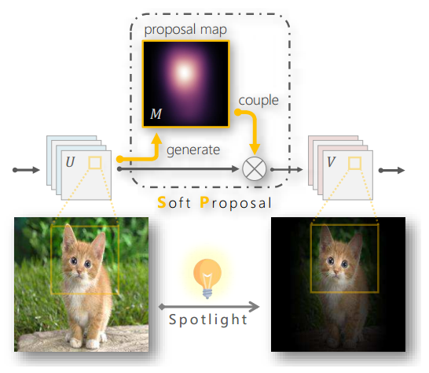
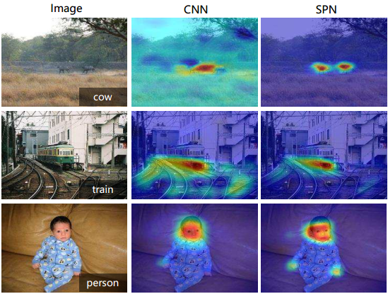
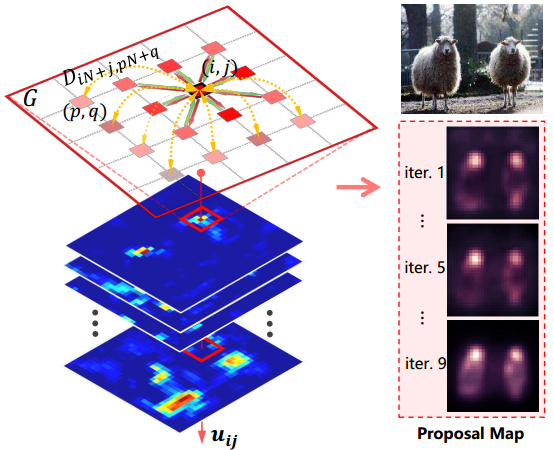
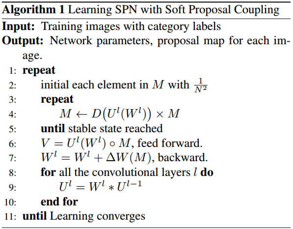
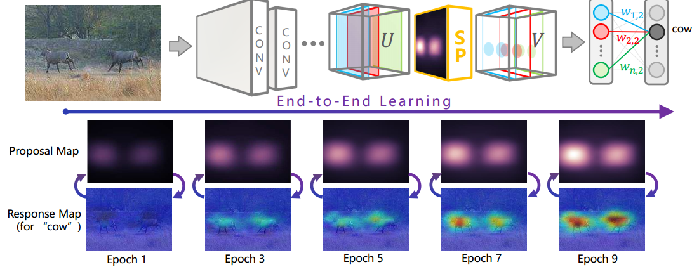
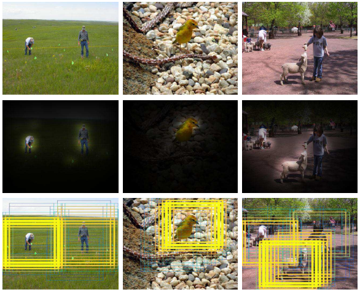
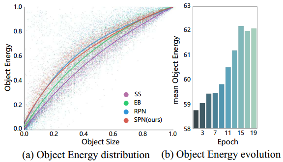
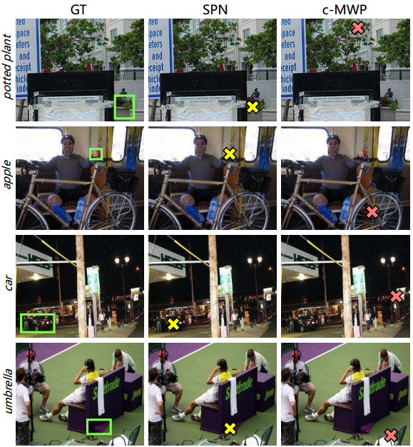
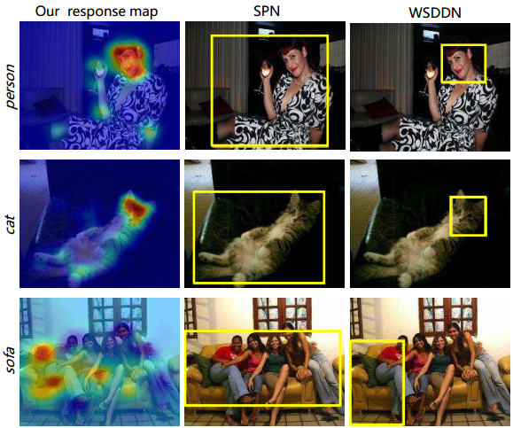

# Soft Proposal Networks for Weakly Supervised Object Localization

# 弱监督目标定位的SPN（Soft Proposal Networks）论文重点摘录及阅读笔记

## 摘要

仅使用图像标签而不用边界框的弱监督目标定位仍是一个有挑战性的课题。
在定位模型中，Object proposals是非常有效的组件，但它常常难于计算。
本文中，我们首次将弱监督的Object proposal集成到CNNs端到端的网络中。
设计并提出了一种网络组件SP（Soft Proposal），可嵌入标准CNN结构中，几乎无消耗地提供Object proposal。
SP强化的CNN，后称Soft Proposal Networks (SPNs)，基于deep feature maps迭代进化的Object proposal投射回原图像，
而后仅使用图像标签训练和调整优化网络参数。
经过统一的学习过程，SPN可学得更佳的目标中心filter，发现更多discriminative信息，抑制背景影响。
在多个评价标准下，同时大幅提升弱监督目标定位和分类的性能。

## 1 简介

Object Proposal的成功推动了目标定位的进程。

本文设计了一种网络组件，SP（Soft Proposal），可插入标准卷积结构来提供几乎无计算量的Object Proposal。

## 3 SPN（Soft Proposal Network）

提出一个网络组件，SP（Soft Proposal），可插入标准卷积结构来提供几乎无计算量的Object Proposal。
使用了SP模块的CNN称作SPN。

本文中我们只把SPN插入CNN的最后一个卷积层，该层深度信息最丰富，SPN具有一个空间池化层来输出与图像标签相关联的特征。

SP生成步骤通过在深度响应的对应区域运行图传播算，来点亮目标定位的潜在区域。

SP合成（Soft Proposal Coupling）,该步骤利用生成的Proposal Map来积聚生成Feature Map。

通过迭代更新的Proposal生成、合成、激活，达到SPN端到端的过程。

SP（Soft Proposal）模块可插入任意CNN层。基于Deep Feature Map U来创建Proposal Map M，U和M合并成V。
M在训练优化过程中逐步点亮目标信息区域。

CNN网络CAM（Class Activation Map）的可视化和SPN对比。

CNN易受到背景噪声误导，例如奶牛类图中的草，及共同出现物体误导，例如火车类图中的钢轨。

相反，SPN在训练关注于目标信息区域来获得更细粒度的信息，例如人类图中的手，同时抑制背景的影响。

### 3.1 Soft Proposal生成

Proposal Map $ M \in R^{N \times N} $

SP生成在单个SPN前向传播的过程（对应算法1中的内层循环）。根据经验，生成过程一半10次左右迭代达到稳定。

$ M \in R^{N \times N} $

$ U^l \in R^{K \times N \times N} $

$ {N \times N} $

$ u_{i,j}^l = U_{\cdot ,i,j}^l \in R^K $

$ D \in R^{ N^2 \times N^2 } $

$ D_{iN+j,pN+q} $

$ D_{iN+j,pN+q}^{\prime} \triangleq  \| u_{i,j}^l - u_{i,j}^l \| \cdot L(i-p,j-q) $

$ L(i-p,j-q) \triangleq \exp(-\frac{a^2+b^2}{2\epsilon}) $

$ D_{a,b} = \frac{D_{a,b}^{\prime}}{\textstyle\sum_{a=1}^N{D_{a,b}^N}} $

$$
M \gets D \times M
$$

$$
M \gets D(U^l(W^l)) \times M
$$

### 3.2 Soft Proposal Coupling (SP合成)

通过弱监督Deep Feature Map生成的Proposal Map可以看做Objectness Map，其显示了可能是目标物体的区域。
从图像表示角度说，Proposal Map点亮了图像分类的“感兴趣区域”。

SP强化的CNN前向传播时，每个Feature Map被合成为$ V \in R^{N \times N} $，它是对应的Feature Map U与Proposal Map M的Hadamard积（元素乘）。

$$
V_k = U_k^l(W^l) \circ M, k=1,2, \dots ,K 
$$

式中，k表示通道序号，$ \circ $表示元素乘。经过合成的Feature Map V前向传播来预测$ y \in R^C $得分，C表示类别。
再与标签t计算预测错误$ E = \ell(y,t) $，式中$ \ell(\cdot) $表示损失函数。

SPN的反向传播过程，梯度受M影响

$$
W^l = W^l + \Delta W(M) = W^l - \eta \frac{\partial E}{\partial W^l}(M)
$$

其中，$\eta$表示学习率，$\Delta W(M)$代表$W^l$随M而变化，因为梯度$\frac{\partial E}{\partial W^l}$随而变化。

因此，SPN在信息更丰富的区域学习了更多，同时减少了背景的影响。

### 3.3 Weakly Supervised Activation 弱监督激活

弱监督学习任务使用空间池化层来累积Deep Feature Map形成特征向量，而后将这个特征向量用全连接层与图像分类连接。

第一行：SPN架构

第二行：展示Proposal Map在训练过程中各训练代的演化(对应算法1中的外层循环)。

第三行：展示"奶牛"类相应图的演化进程。

SP模块产生的Proposal Map不断迭代演化，同时随卷积网络的训练过程优化，使SPN习得细粒度的视觉信息以便于定位。

## 实验

4.1 SPN与传统Object Proposal方法的对比，显示出SPN能在几乎可忽略的计算量下生成高质量的Proposal。

4.2 弱监督点定位，SPN可以学得更佳的物体置于中心的模型，提供准确的类响应。

4.3 进一步在弱监督Bounding Box定位任务上测试SPN，验证其发掘更复杂场景、更细粒度的视觉信息的能力。

4.4 SPN对分类问题的性能提升。

使用SGD（随机梯度下降法）训练SPN，损失函数采用交叉熵，权重衰减0.0005，动量0.9，初始学习率0.01。

