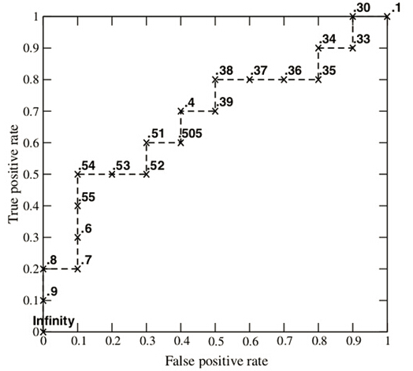
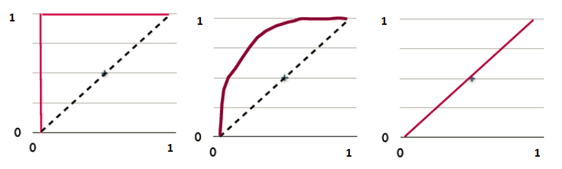
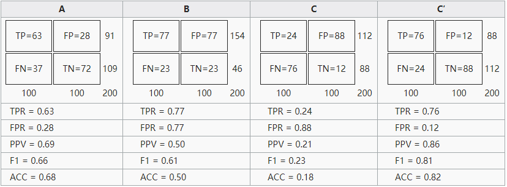
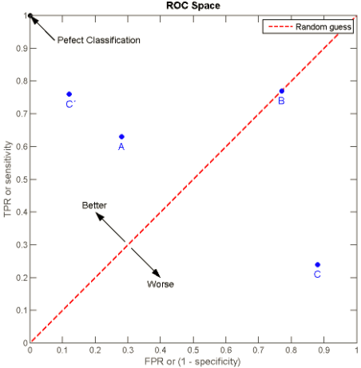

# 受试者工作特征 ROC（Receiver Operating Characteristic）：空间、曲线（ROC Curve）及面积（AUROC）

## ROC定义

> 接前文 TODO引用前文

受试者工作特征曲线 （Receiver Operating Characteristic curve，简称ROC曲线），又称为感受性曲线（Sensitivity curve）。
ROC曲线就是以假正类率FPR（False Positive Rate）为横轴，真正类率TPR（True Positive Rate）为纵轴所组成的坐标图，
利用模型采用不同的判断标准得出的不同结果画出的曲线。

根据每个测试样本属于正样本的概率值从大到小排序。下图是一个示例，图中共有20个测试样本，“Class”一栏表示每个测试样本真正的标签（p表示正样本，n表示负样本），“Score”表示每个测试样本属于正样本的概率。

| 序号 | 类别 | 得分 | TPR | FPR | | 序号 | 类别 | 得分 | TPR | FPR |
| --- | --- | --- | --- | --- | --- | --- | --- | --- | --- | --- |
| 1 | p | 0.9 | 0.1 | 0 | |  11 | p | 0.4 | 0.7 | 0.4 |
| 2 | p | 0.8 | 0.2 | 0 | |  12 | n | 0.39 | 0.7 | 0.5 |
| 3 | n | 0.7 | 0.2 | 0.1 | |  13 | p | 0.38 | 0.8 | 0.5 |
| 4 | p | 0.6 | 0.3 | 0.1 | |  14 | n | 0.37 | 0.8 | 0.6 |
| 5 | p | 0.55 | 0.4 | 0.1 | |  15 | n | 0.36 | 0.8 | 0.7 |
| 6 | p | 0.54 | 0.5 | 0.1 | |  16 | n | 0.35 | 0.8 | 0.8 |
| 7 | n | 0.53 | 0.5 | 0.2 | |  17 | p | 0.34 | 0.9 | 0.8 |
| 8 | n | 0.52 | 0.5 | 0.3 | |  18 | n | 0.33 | 0.9 | 0.9 |
| 9 | p | 0.51 | 0.6 | 0.3 | |  19 | p | 0.30 | 1.0 | 0.9 |
| 10 | n | 0.505 | 0.6 | 0.4 | |  20 | n | 0.1 | 1.0 | 1.0 |

接下来，我们从高到低，依次将“Score”值作为阈值threshold，当测试样本属于正样本的概率大于或等于这个threshold时，我们认为它为正样本，否则为负样本。举例来说，对于图中的第4个样本，其“Score”值为0.6，那么样本1，2，3，4都被认为是正样本，因为它们的“Score”值都大于等于0.6，而其他样本则都认为是负样本。每次选取一个不同的threshold，我们就可以得到一组FPR和TPR，即ROC曲线上的一点。这样一来，我们一共得到了20组FPR和TPR的值，将它们画在ROC曲线的结果如下图：

当我们将threshold设置为1和0时，分别可以得到ROC曲线上的(0,0)和(1,1)两个点。将这些(FPR,TPR)对连接起来，就得到了ROC曲线。当threshold取值越多，ROC曲线越平滑。

其实，我们并不一定要得到每个测试样本是正样本的概率值，只要得到这个分类器对该测试样本的“评分值”即可（评分值并不一定在(0,1)区间）。评分越高，表示分类器越肯定地认为这个测试样本是正样本，而且同时使用各个评分值作为threshold。我认为将评分值转化为概率更易于理解一些。

## AUC值的计算

AUC (Area Under Curve) 被定义为ROC曲线下的面积，显然这个面积的数值不会大于1。又由于ROC曲线一般都处于y=x这条直线的上方，所以AUC的取值范围一般在0.5和1之间。使用AUC值作为评价标准是因为很多时候ROC曲线并不能清晰的说明哪个分类器的效果更好，而作为一个数值，对应AUC更大的分类器效果更好。

AUC的计算有两种方式，梯形法和ROC AUCH法，都是以逼近法求近似值

## AUC意味着什么

那么AUC值的含义是什么呢？根据(Fawcett, 2006)，AUC的值的含义是：

> The AUC value is equivalent to the probability that a randomly chosen positive example is ranked higher than a randomly chosen negative example.

这句话有些绕，我尝试解释一下：首先AUC值是一个概率值，当你随机挑选一个正样本以及一个负样本，当前的分类算法根据计算得到的Score值将这个正样本排在负样本前面的概率就是AUC值。当然，AUC值越大，当前的分类算法越有可能将正样本排在负样本前面，即能够更好的分类。

从AUC判断分类器（预测模型）优劣的标准：

AUC = 1，是完美分类器，采用这个预测模型时，存在至少一个阈值能得出完美预测。绝大多数预测的场合，不存在完美分类器。
0.5 < AUC < 1，优于随机猜测。这个分类器（模型）妥善设定阈值的话，能有预测价值。
AUC = 0.5，跟随机猜测一样（例：丢铜板），模型没有预测价值。
AUC < 0.5，比随机猜测还差；但只要总是反预测而行，就优于随机猜测。

简单说：AUC值越大的分类器，正确率越高。

Plots of the four results above in the ROC space are given in the figure. The result of method A clearly shows the best predictive power among A, B, and C. The result of B lies on the random guess line (the diagonal line), and it can be seen in the table that the accuracy of B is 50%. However, when C is mirrored across the center point (0.5,0.5), the resulting method C′ is even better than A. This mirrored method simply reverses the predictions of whatever method or test produced the C contingency table. Although the original C method has negative predictive power, simply reversing its decisions leads to a new predictive method C′ which has positive predictive power. When the C method predicts p or n, the C′ method would predict n or p, respectively. In this manner, the C′ test would perform the best. The closer a result from a contingency table is to the upper left corner, the better it predicts, but the distance from the random guess line in either direction is the best indicator of how much predictive power a method has. If the result is below the line (i.e. the method is worse than a random guess), all of the method's predictions must be reversed in order to utilize its power, thereby moving the result above the random guess line.